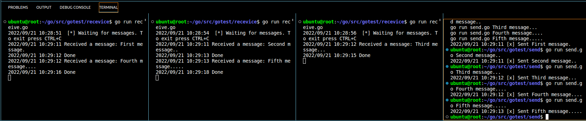

本节会创建一个`work queue`,它将在多个工作中分发耗时消费任务。

`work queue`的核心避免快速处理资源密集的任务，必须等待来完成，相反是在完成之后进行调度。封装一个任务作为消息发送给一个队列，一个在后台运行的任务程序将会弹出并处理执行该任务。当有很多works的时候将会在它们之间进行共享。

本节内容在web服务中是极其有用的，可以在一个短的http请求中处理一个完整的任务（例如注册时发送邮件或短信验证码等场景）。

本节代码基于前一节进行改动，只展示改动部分：借助`time.Sleep`函数模拟一些比较耗时的任务——将一些包含`.`的字符串封装成消息发送，有一个`.`就表示需要耗费1秒钟的工作。

# 一

默认情况下，rabbitMQ会给每一个消费者发送每一条消息，平均每一个消费者均会得到相同数量的信息。以下方法称为循环：生产者发送消息的时候，存在多个消费者的时候，消费者依次获取信息。

**Round-robin**的优点是可较容易的并行化，如果工作积压，可以增加多个工人，轻松完成

## send.go

```go
//定义的队列是幂等的，消息内容是byte数组
	body := bodyFrom(os.Args)
	//body := "Hello World"

```

添加bodyFrom方法，读取命令行参数信息

```go
func bodyFrom(args []string) string {
	var s string
	if (len(args) < 2) || os.Args[1] == "" {
		s = "Hello"
	} else {
		s = strings.Join(args[1:], " ")
	}
	return s
}
```

## receive.go

```go
	go func() {
		for d := range msgs {
			log.Printf("Received a message: %s", d.Body)
			dotCount := bytes.Count(d.Body, []byte("."))
			t := time.Duration(dotCount)
			time.Sleep(time.Second * t) //模拟耗时任务
			log.Printf("Done")
		}
	}()
```

## 运行

```shell
go run send.go First message.
go run send.go Second message..
go run send.go Third message...
go run send.go Fourth message....
go run send.go Fifth message.....
```



# 二

在上述模拟程序中，如果一个消费者执行了一个较长的任务的时候宕机，我们可能会觉得在接收消息的时候可能会出现消息丢失的情况，但实际上情况并没有想象的那么糟糕。并没有丢失任何一个任务消息，其他运行的接受者会接替已经死亡的这个节点，确保接收信息的准确性。

原因是RabbitMQ提供`ack`确认机制，接受者会提供一个确认信号返回给rabbitmq告知信息已经被取出。

```go
	//将告诉服务段请在队列中传输消息，我们将在管道中读取到该消息
	msgs, err := ch.Consume(
		q.Name, //queue
		"", //consumer
		true, //ack
		false,//exclusive
		false,//no-local
		false,//no-wait
		nil,//args
	)
```

如果消费者消失（chan关闭，连接关闭或者TCP连接丢失）没有发送ack，rabbitMQ会认为该信息并没有被完整接收，将会返回到队列中。与此同时如果存在其他的消费者的话，会快速传递给其他消费值。

设置ack为false进行手动确认

```go
	msgs, err := ch.Consume(
		q.Name,
		"",
		false,
		//true, //ack
		false,
		false,
		false,
		nil,
	)
	failOnError(err, "Failed to register a consumer")

	var forever chan struct{}
	//forever := make(chan bool)

	go func() {
		for d := range msgs {
			log.Printf("Received a message: %s", d.Body)
			dotCount := bytes.Count(d.Body, []byte("."))
			t := time.Duration(dotCount)
			time.Sleep(time.Second * t)
			log.Printf("Done")
			d.Ack(false)
		}
	}()
```

# 公平分发

如果存在调度的不公平性，例如：存在两个任务，但在任务分发的时候，存在奇数任务重，偶数轻，如果依旧按照上述的分配方式，会出现资源闲置的问题。

**解决：**可以将预取计数设置为1（目的是告诉不要向一个work发出多个消息——在处理并确认前一条消息的之前，不要重复发送）。

```go
err = ch.Qos(
  1,     // prefetch count
  0,     // prefetch size
  false, // global
)
```
