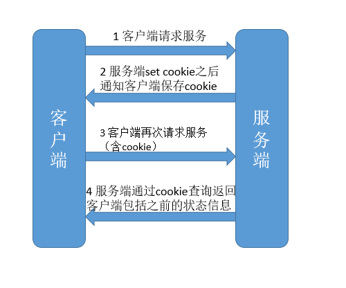

# cookie和Session

均是用来跟踪浏览器用户身份的会话方式

## cookie

客户端保存用户信息的一种机制：在本地机器上存储的小文本，每次请求回发送到服务器——通过请求和响应报文中写入的cookie来控制客户端的状态。

## session

服务端执行session的时候，会将`session id`保存到cookie中。

## 区别

1. cookie保存在客户端，session保存在服务端，但session的实现和cookie有一定的关系。
2. cookie并不安全，可以通过修改cookie信息来进行cookie欺骗。
3. session会在一定时间内保存在服务器上。当访问增多，会比较占用你服务器的性能，如果主要考虑到减轻服务器性能方面，应当使用COOKIE
4. 单个cookie在客户端的限制是3K，就是说一个站点在客户端存放的COOKIE不能3K。
5. 所以：将登陆信息等重要信息存放为SESSION;其他信息如果需要保留，可以放在COOKIE中