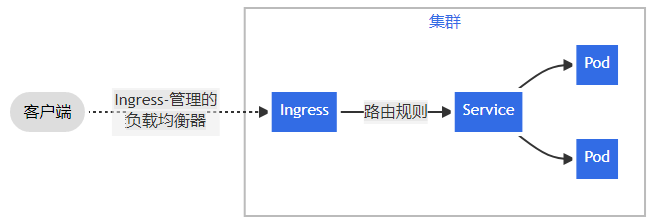
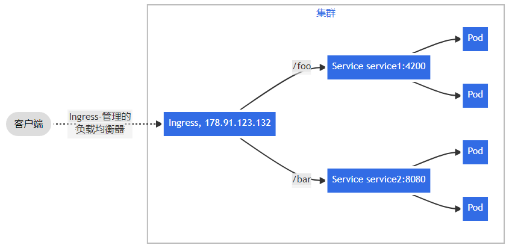
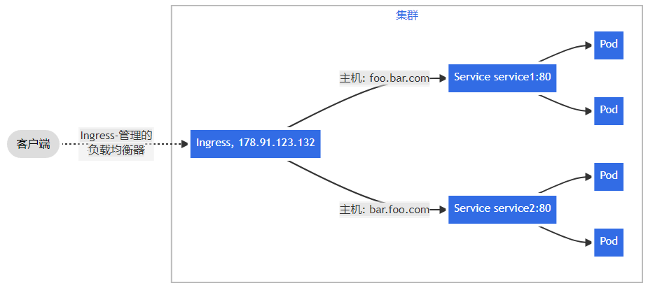

# ingress-nginx简介

公开从集群外部到集群内服务的http和https路由。流量路由有Ingress组员上定义的规则控制。



## 规则

```yaml
apiVersion: networking.k8s.io/v1
kind: Ingress
metadata:
  name: ingress-http
  annotations:
    kubernetes.io/ingress.class: "nginx"
spec:
  rules:
  #- host: nginx.mytest.org
  - http:
      paths:
      - path: /
        pathType: Prefix
        backend:
          service:
            name: nginx-service
            port:
              number: 80
```

- host（可选）：

  未指定host——适用于通过指定IP地址的所有入站HTTP通信

  指定host——该规则使用于该host

- paths：每一个路径都有一个由serviceName和servicePort定义关联后端。

- backend：服务名称和端口名称的组合。

## Ingress类型

### 简单扇出（fanout）

根据请求的http URI将来自同一IP地址的路由到多个service。



### 基于名称的虚拟托管

针对多个主机名的http流量路由由到同一个IP地址上。



如，以下 Ingress 会将请求 `first.bar.com` 的流量路由到 `service1`，将请求 `second.bar.com` 的流量路由到 `service2`，而所有其他流量都会被路由到 `service3`。

```yaml
apiVersion: networking.k8s.io/v1
kind: Ingress
metadata:
  name: name-virtual-host-ingress-no-third-host
spec:
  rules:
  - host: first.bar.com
    http:
      paths:
      - pathType: Prefix
        path: "/"
        backend:
          service:
            name: service1
            port:
              number: 80
  - host: second.bar.com
    http:
      paths:
      - pathType: Prefix
        path: "/"
        backend:
          service:
            name: service2
            port:
              number: 80
  - http:
      paths:
      - pathType: Prefix
        path: "/"
        backend:
          service:
            name: service3
            port:
              number: 80
```