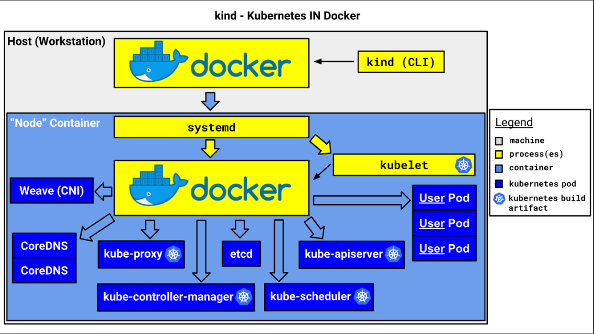

在创建k8s集群可参考[kind安装部署k8s集群]()

# 查看运行的节点

创建了3个work节点和3个master

```shell
[root@host-server ~]# kubectl get nodes
NAME                  STATUS   ROLES           AGE     VERSION
kind-control-plane    Ready    control-plane   4h23m   v1.25.0
kind-control-plane2   Ready    control-plane   4h22m   v1.25.0
kind-control-plane3   Ready    control-plane   4h22m   v1.25.0
kind-worker           Ready    <none>          4h21m   v1.25.0
kind-worker2          Ready    <none>          4h21m   v1.25.0
kind-worker3          Ready    <none>          4h21m   v1.25.0
```

# 如何运行

在宿主机中，使用kubectl就可以完成几大部分的k8s操作，有些人可能就对于和平常看见的k8s部署不同，包括看不见构建k8s的镜像、它到底是如何部署上去、怎么就成功部署了3个works和3个master等有诸多的疑惑。

先上图：



在此也仅是简单介绍该工作流程，如果需要进一步了解，可参考[kind文档](https://kind.sigs.k8s.io/)

1. 采用镜像的方式构建k8s node节点

   kind,原文就是 Kubernetes in docker 。这样事情也就变得明朗起来。将k8s环境以docker container的方式搭建。

   ```shell
   [root@host-server ~]# docker ps -a
   CONTAINER ID        IMAGE                                COMMAND                  CREATED             STATUS              PORTS                       NAMES
   a9459c6610fd        kindest/haproxy:v20220607-9a4d8d2a   "haproxy -sf 7 -W -d…"   4 hours ago         Up 4 hours          127.0.0.1:34805->6443/tcp   kind-external-load-balancer
   1747e4be5b45        kindest/node:v1.25.0                 "/usr/local/bin/entr…"   4 hours ago         Up 4 hours                                      kind-worker2
   1af5558bd923        kindest/node:v1.25.0                 "/usr/local/bin/entr…"   4 hours ago         Up 4 hours          127.0.0.1:46155->6443/tcp   kind-control-plane3
   d8fd68d3fb29        kindest/node:v1.25.0                 "/usr/local/bin/entr…"   4 hours ago         Up 4 hours          127.0.0.1:38435->6443/tcp   kind-control-plane
   543d3a6c7d22        kindest/node:v1.25.0                 "/usr/local/bin/entr…"   4 hours ago         Up 4 hours                                      kind-worker
   78580624a92e        kindest/node:v1.25.0                 "/usr/local/bin/entr…"   4 hours ago         Up 4 hours          127.0.0.1:34349->6443/tcp   kind-control-plane2
   35e8c2851baf        kindest/node:v1.25.0                 "/usr/local/bin/entr…"   4 hours ago         Up 4 hours                                      kind-worker3
   ```

2. 简化了环境的搭建

   kind命令的使用，可以让操作者不在纠结搭建环境中出现的错误，毕竟在搭建环境的过程中，可能常常会出现各种各样的问题，最终导致从入门到放弃。

3. 进入节点内部

   以容器的方式进入节点环境，容器中涵盖了k8s所需的环境，包括kubeadm 、kubectl 、kubelet管理套件，

   ```shell
   [root@host-server ~]# docker exec -it kind-worker bash
   root@kind-worker:/# kube
   kubeadm  kubectl  kubelet
   ```

4. 采用crictl的方式 检查和调试kubernetes节点上的容器运行时和应用程序，其余的操作命令可参见https://kubernetes.io/zh-cn/docs/tasks/debug/debug-cluster/crictl/

   ```shell
   root@kind-worker:/# crictl pods
   POD ID              CREATED             STATE               NAME                NAMESPACE           ATTEMPT             RUNTIME
   70378a1203be0       5 hours ago         Ready               kube-proxy-9b29x    kube-system         0                   (default)
   1155cba575f39       5 hours ago         Ready               kindnet-ftncm       kube-system         0                   (default)
   ```