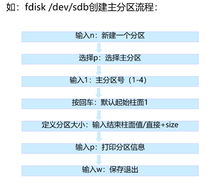
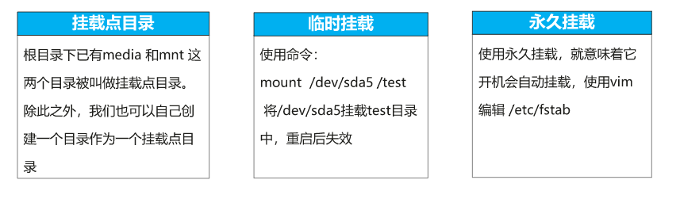
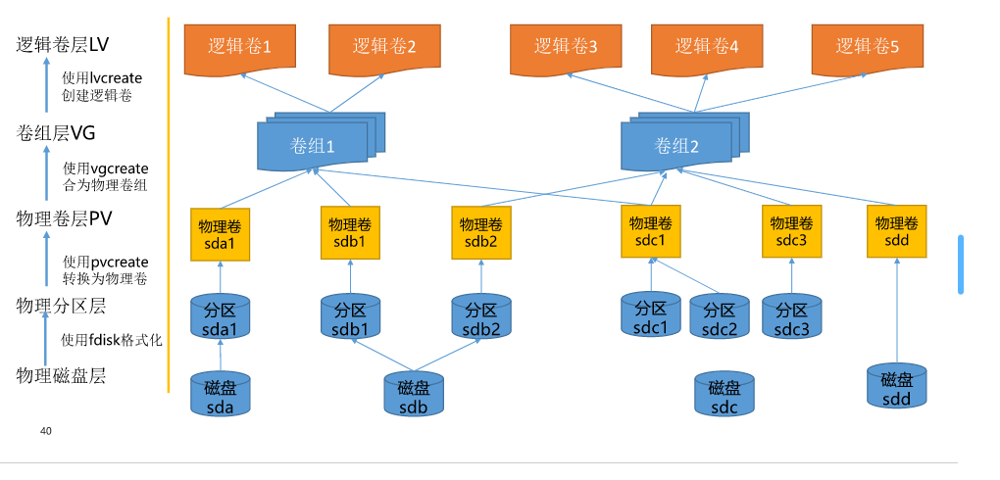

## Linux  查看磁盘信息

### fdisk

传统的LInux硬盘分区工具，不支持大于2TB的分区

1. `fdisk -l`用于查看系统所有磁盘的信息，包括已挂载和未挂载的。

   ```shell
   [root@localhost ~]# fdisk -l
   #查询可以识别的硬盘和分区，
   Disk /dev/sda: 64 GiB, 68719476736 bytes, 134217728 sectors
   Disk model: VBOX HARDDISK
   Units: sectors of 1 * 512 = 512 bytes
   #每个柱面的大小
   Sector size (logical/physical): 512 bytes / 512 bytes
   #每个扇区的大小
   I/O size (minimum/optimal): 512 bytes / 512 bytes
   Disklabel type: dos
   Disk identifier: 0xec53cfb6
   
   Device     Boot   Start       End   Sectors Size Id Type
   /dev/sda1  *       2048   2099199   2097152   1G 83 Linux
   /dev/sda2       2099200 134217727 132118528  63G 8e Linux LVM
   
   
   Disk /dev/sdb: 5 GiB, 5368709120 bytes, 10485760 sectors
   Disk model: VBOX HARDDISK
   Units: sectors of 1 * 512 = 512 bytes
   Sector size (logical/physical): 512 bytes / 512 bytes
   I/O size (minimum/optimal): 512 bytes / 512 bytes
   
   
   Disk /dev/mapper/openeuler-root: 39.66 GiB, 42580574208 bytes, 83165184 sectors
   Units: sectors of 1 * 512 = 512 bytes
   Sector size (logical/physical): 512 bytes / 512 bytes
   I/O size (minimum/optimal): 512 bytes / 512 bytes
   
   
   Disk /dev/mapper/openeuler-swap: 3.98 GiB, 4269801472 bytes, 8339456 sectors
   Units: sectors of 1 * 512 = 512 bytes
   Sector size (logical/physical): 512 bytes / 512 bytes
   I/O size (minimum/optimal): 512 bytes / 512 bytes
   
   
   Disk /dev/mapper/openeuler-home: 19.36 GiB, 20791164928 bytes, 40607744 sectors
   Units: sectors of 1 * 512 = 512 bytes
   Sector size (logical/physical): 512 bytes / 512 bytes
   I/O size (minimum/optimal): 512 bytes / 512 bytes
   
   ```

2. 分区操作：

   

### mkfs

mkfs命令是make filename的缩写，用来在特定的分区建立linux文件系统

磁盘格式化，将分区格式化成不同的文件系统

- 查看支持的文件类型

  ```shell
  [root@localhost ~]# mkfs
  mkfs         mkfs.cramfs  mkfs.ext2    mkfs.ext3    mkfs.ext4    mkfs.minix   mkfs.xfs
  ```

- 磁盘格式化

  ```shell
  [root@localhost ~]# mkfs.ext4 /dev/sdb1
  mke2fs 1.45.6 (20-Mar-2020)
  Creating filesystem with 1310464 4k blocks and 327680 inodes
  Filesystem UUID: 24b23662-dd7e-4d2a-8693-cbac942ece08
  Superblock backups stored on blocks:
          32768, 98304, 163840, 229376, 294912, 819200, 884736
  
  Allocating group tables: done
  Writing inode tables: done
  Creating journal (16384 blocks): done
  Writing superblocks and filesystem accounting information: done
  ```

### mount

磁盘挂载，想要使用磁盘，需要先建立一个联系，也就是目录。



### df（disk free）

用来检查Linux服务器的文件系统的磁盘空间占用率——获取硬盘被占用了多少，目前还剩下多少空间信息。

1. `dh -h`查看系统挂载、磁盘空间大小和利用率。

### du（disk uasge)

显示每个文件和目录的磁盘使用空间。

### parted

常用的分区软件，可支持创建2T以上的磁盘分区，相对于fdisk，使用方便、也可动态调整分区大小。

```shell
[root@localhost dev]# parted -h
#device:磁盘设备名称。
#command：没有默认进入交互模式。
Usage: parted [OPTION]... [DEVICE [COMMAND [PARAMETERS]...]...]
Apply COMMANDs with PARAMETERS to DEVICE.  If no COMMAND(s) are given, run in
interactive mode.

OPTIONs:
  -h, --help                      displays this help message
  -l, --list                      lists partition layout on all block devices
  -m, --machine                   displays machine parseable output
  -s, --script                    never prompts for user intervention
  -v, --version                   displays the version
  -a, --align=[none|cyl|min|opt]  alignment for new partitions

[root@localhost dev]# parted -l
Model: ATA VBOX HARDDISK (scsi)
Disk /dev/sda: 68.7GB
Sector size (logical/physical): 512B/512B
Partition Table: msdos
Disk Flags:

Number  Start   End     Size    Type     File system  Flags
 1      1049kB  1075MB  1074MB  primary  ext4         boot
 2      1075MB  68.7GB  67.6GB  primary               lvm
[root@localhost ~]# parted /dev/sdb
GNU Parted 3.3
Using /dev/sdb
Welcome to GNU Parted! Type 'help' to view a list of commands.
(parted)  mklabel msdos
Warning: The existing disk label on /dev/sdb will be destroyed and all data on this disk will be lost. Do you want to continue?
Yes/No? yes
(parted) quit
Information: You may need to update /etc/fstab.

```


## 磁盘分区

磁盘分局将硬盘驱动划分为多个逻辑存储单元，这些成为**分区**。

指的是磁盘分区表。

分区好处：

- 限制应用或用户的可用空间。
- 允许从同一磁盘不同操作系统的多重启动。
- 将操作系统和程序文件与用户文件分隔。
- 创建用于操作系统虚拟内存交换的单独区域。
- 限制磁盘空间使用情况，以提高诊断工具和备份影像的性能。

### 分区类型

**一个硬盘只有一个扩展分区，除去主分区，其它空间都是分配给扩展分区**

硬盘容量=主分区+扩展分区（各逻辑分区容量和）

- 主分区

  主磁盘分区，不能再活粉其他类型的分区。

- 扩展分区、逻辑分区

  扩展分区不能直接使用，需要划分一个或多个逻辑分区后才能使用。

**分区：**前4个分区用到的是数字1和数字4，逻辑分区从5开始

## 逻辑卷

LVM-逻辑卷管理是linux环境中对磁盘分区进行管理的一种机制，是建立在硬盘和分区之上、文件系统之下的一个逻辑层，可提高磁盘分区管理的灵活性。

### 原理及优点

逻辑卷（lv）是将几个磁盘分区或者块设备（pv可以位于不同的磁盘分区里，大小可以不同）组织起来形成一个大的扩展分区（一个vg卷组至少已包含一个pv）。该扩展分区不能直接用，需要将其划分成逻辑卷才能使用，lv可以格式化不同的文件系统，挂载后直接使用。

- 灵活的容量
- 可伸缩的存储池
- 在线数据再分配
- 方便的设备命名
- 磁盘条带化
- 卷镜像和卷快照



### 物理卷

1. 创建物理卷

```shell
[root@localhost ~]# pvcreate /dev/sdb
WARNING: dos signature detected on /dev/sdb at offset 510. Wipe it? [y/n]: y
  Wiping dos signature on /dev/sdb.
  Physical volume "/dev/sdb" successfully created.
```

2. 查看物理卷 

   ```shell
   [root@bogon ~]# pvdisplay
     --- Physical volume ---
     PV Name               /dev/sda2
     VG Name               openeuler
     PV Size               <63.00 GiB / not usable 3.00 MiB
     Allocatable           yes (but full)
     PE Size               4.00 MiB
     Total PE              16127
     Free PE               0
     Allocated PE          16127
     PV UUID               5Fo0gc-r6Rc-r3Mb-szSD-UXYd-Au3u-fnejHG
   
     --- Physical volume ---
     PV Name               /dev/sdb
     VG Name               openeuler
     PV Size               5.00 GiB / not usable 4.00 MiB
     Allocatable           yes
     PE Size               4.00 MiB
     Total PE              1279
     Free PE               767
     Allocated PE          512
     PV UUID               HFxCFH-9zVN-bNLe-MvPk-XsR3-WoR1-x0qzGP
   ```

3. 删除物理卷——pvremove

### 卷组

1. 创建卷组

   openeuler:要创建的卷组名称

   /dev/sdb：要加入到卷组中的物理卷名称

   ```shell
   [root@bogon ~]# vgcreate openeuler /dev/sdb
   ```

2. 查看卷组

   ```shell
   [root@bogon ~]# vgdisplay
     --- Volume group ---
     VG Name               openeuler
     System ID
     Format                lvm2
     Metadata Areas        2
     Metadata Sequence No  6
     VG Access             read/write
     VG Status             resizable
     MAX LV                0
     Cur LV                3
     Open LV               3
     Max PV                0
     Cur PV                2
     Act PV                2
     VG Size               67.99 GiB
     PE Size               4.00 MiB
     Total PE              17406
     Alloc PE / Size       16639 / <65.00 GiB
     Free  PE / Size       767 / <3.00 GiB
     VG UUID               TqFQNR-tYQb-Pe44-NlGo-rw7h-wohD-yYEEax
   ```

3. 扩展卷组

   openeuler:要扩展的卷组的名称

   /dev/sdb：要加入到卷组中的物理卷名称

   ```shell
    vgextend openeuler /dev/sdb
   ```

4. 收缩卷组

   openeuler:要收缩的卷组的名称

   /dev/sdb：要收缩到卷组中的物理卷名称

   ```
   [root@bogon ~]# vgreduce  openeuler /dev/sdb
   ```

### 逻辑卷

1. 查看卷组中是否存在多余的空间

```shell
[root@localhost home]# vgs
  VG        #PV #LV #SN Attr   VSize  VFree
  openeuler   2   3   0 wz--n- 67.99g <3.00g
```

2. 扩容&&缩容

   ```shell
   #调整LVM逻辑卷的大小，可增大和缩小空间，但再调整过程中数据容易丢失。
   lvresize -L +2048 /dev/openeuler/home
   #扩展逻辑卷
   lvextend -L +100M /dev/openeuler/home
   #调整文件系统大小
   resize2fs  /dev/openeuler/root
   ```

   **扩容**

   - 确定是否有vg空间
   - 使用lvextend扩容
   - 调整文件系统的大小

   **缩容**

   - 确定缩容后目标的大小。确保有对应目标大小的空间可以容纳
   - 卸载文件系统
   - 缩减文件系统
   - 缩减逻辑卷
   - 重新挂载使用

3. 查看逻辑卷

   ```shell
   [root@bogon ~]# lvdisplay /dev/openeuler/home
     --- Logical volume ---
     LV Path                /dev/openeuler/home
     LV Name                home
     VG Name                openeuler
     LV UUID                1yCVn0-8tGc-WfaM-ayVk-fyDr-7Zjm-rasO9o
     LV Write Access        read/write
     LV Creation host, time localhost, 2022-08-25 11:22:05 +0800
     LV Status              available
     # open                 1
     LV Size                21.36 GiB
     Current LE             5469
     Segments               2
     Allocation             inherit
     Read ahead sectors     auto
     - currently set to     8192
     Block device           253:2
   ```

   